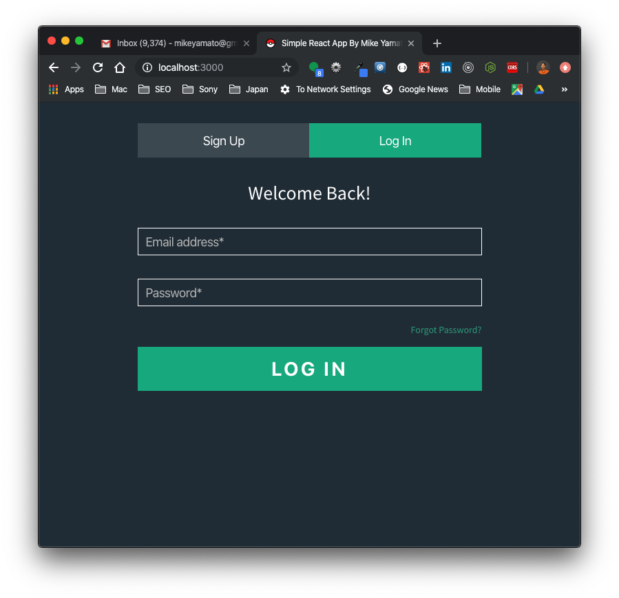

# Simple Account Creation & Password Reset Application

This is a small single page application that takes in a user's first name, last name, email address, and password to create an account. User information is saved to a NoSql database (MongoDB) allowing for easy login (email and password) for future visits. In the event that a user forgets their password, this can be reset through email validation.

## Contact
Name: Shinsuke "Mike" Yamato \
Email: <mikeyamato@gmail.com> \
Phone: (747) 215-7826 \
Links: [Resume](https://drive.google.com/open?id=11qNVWbtrlGp3IGo_LU0F_oytscXFw4DI), [LinkedIn](https://www.linkedin.com/in/mikeyamato/), [GitHub](https://github.com/mikeyamato)

## Setup

Initial setup. In addition to running `npm install` from the root of this project folder, you will also need to run `npm install` from within the `client` directory.
```bash
npm install
cd client
npm install
cd ..
npm run dev
```

Start app
```node
npm run dev
```

App will automatically start on `http://localhost:3000`

NOTE: `.env` files (provided) required. Place the corresponding file either in the root of the project directory or inside the `client` directory. 

## Technology used
Backend
* [Node](https://nodejs.org/en/)
* [Express](https://expressjs.com/)
* [MongoDB](https://www.mongodb.com/cloud/atlas)
* [Passport](http://www.passportjs.org/)
* [TypeScript](https://www.typescriptlang.org/)
* [Winston](https://github.com/winstonjs/winston)
* [SendGrid](https://sendgrid.com/)

Frontend
* [Ant Design](https://ant.design/)
* [Axios](https://github.com/axios/axios)
* [React](https://reactjs.org/)
* [React Router Dom](https://www.npmjs.com/package/react-router-dom)

## Screenshots





